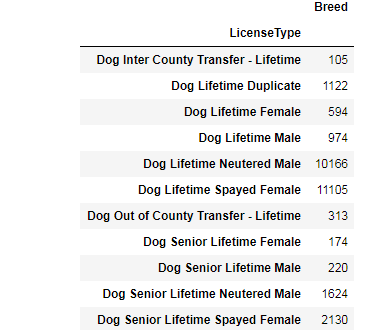
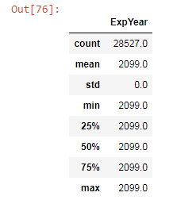

# FinalProject

I chose to utilize Pandas to view csv information given by: 
[Allegheny LifeTime Dog Licenses](https://data.wprdc.org/dataset/allegheny-county-dog-licenses/resource/f8ab32f7-44c7-43ca-98bf-c1b444724598)

[CSV](https://data.wprdc.org/dataset/ad5bd3d6-1b53-4ed0-8cd9-157a985bd0bd/resource/f8ab32f7-44c7-43ca-98bf-c1b444724598/download/2099-05-01.csv) is here.

<table>
    <tr>
        <td>Total</td>
    </tr>
  
</table>

<table>
    <tr>
        <td>File Stats</td>
    </tr>
  
</table>

