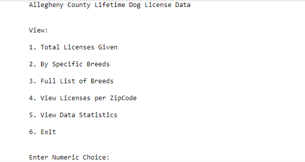

# FinalProject

<em>I chose to utilize PANDAS to view csv information given by: </em> 
[Allegheny LifeTime Dog Licenses](https://data.wprdc.org/dataset/allegheny-county-dog-licenses/resource/f8ab32f7-44c7-43ca-98bf-c1b444724598)
    
    

[CSV](https://data.wprdc.org/dataset/ad5bd3d6-1b53-4ed0-8cd9-157a985bd0bd/resource/f8ab32f7-44c7-43ca-98bf-c1b444724598/download/2099-05-01.csv) is here.

<table>
    <tr>
        <td>Menu</td>
    </tr>
  
</table>

<table>
    <tr>
        <td>1.) Total Licenses Given</td>
    </tr>
  
</table>
For this portion of the options I used a PANDAS counter function. Replacing 'Column' with one of the Indexed Column names to narrow down the display. In my Screenshot I eleiminated, DogName, OwnerZip, Color, ExpYear and ValidDate and what table I 

<pre><code>  df.set_index(["Column", "Column"]).count(level="LicenseType")  </pre></code>

<table>
    <tr>
        <td>File Stats</td>
    </tr>
  
</table>

